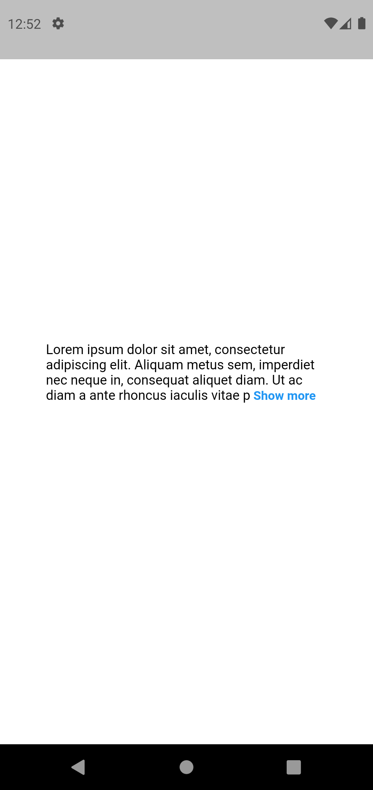

# Widgets [Documentations](https://github.com/ccprogrammer/my-docs/tree/main/lib/docs) List:

Small Code Documentations

1. [ExpandingTextField](lib/docs/the_most_forgotten_code/ExpandingTextField.dart)
2. [IconButtonNoPadding](lib/docs/the_most_forgotten_code/IconButtonNoPadding.dart)
3. [MyBoxShadow](lib/docs/the_most_forgotten_code/MyBoxShadow.dart)
4. [MyRichText](lib/docs/the_most_forgotten_code/MyRichText.dart)
5. [TextButtonNoPadding](lib/docs/the_most_forgotten_code/TextButtonNoPadding.dart)
6. [ListViewNoTopPadding](lib/docs/the_most_forgotten_code/ListViewNoTopPadding.dart)

## Screenshots:

<table align="center" style="margin: 0px auto;">
  <tr>
    <td>
        

            
            
<a href="lib/docs/app_bar/AppBarNormal.dart" target="_blank">AppBarNormal</a>

        

    </td>
    <td>
        

            
            
<a href="lib/docs/app_bar/AppBarSearch.dart" target="_blank">AppBarSearch</a>

        

    </td>
    <td>
        

            
            
<a href="lib/docs/app_bar/AppBarListTile.dart" target="_blank">AppBarListTile</a>

        

    </td>
  </tr>
<!--  Card  -->
  <tr>
   <td>
        

            
            
<a href="lib/docs/card/CardCommon.dart" target="_blank">CardCommon</a>

        

    </td>         
       <td>
        

            
            
<a href="lib/docs/card/CardWithImage.dart" target="_blank">CardWithImage</a>

        

    </td>
       <td>
        

            
            
<a href="lib/docs/card/CardWithMap.dart" target="_blank">CardWithMap</a>

        

    </td>        
   <td>
        

            
            
<a href="lib/docs/card/CardWithStretchHeaderImage.dart" target="_blank">CardWithStretchHeaderImage</a>

        

    </td>
  </tr>
<!--   Loading -->
   <tr>
        <td>
        

            
            
<a href="lib/docs/loading/LoadingShimmers.dart" target="_blank">LoadingShimmers</a>

        

    </td>
  <td>
        

            
            
<a href="lib/docs/loading/ShimmerCard.dart" target="_blank">ShimmerCard</a>

        

    </td>
  <td>
        

            
            
<a href="lib/docs/loading/ShimmerOverview.dart" target="_blank">ShimmerOverview</a>

        

    </td>
  <td>
        

            
            
<a href="lib/docs/loading/ShimmerTile.dart" target="_blank">ShimmerTile</a>

        

    </td>
    
  </tr>
   <tr>
  <td>
        

            
            
<a href="lib/docs/loading/Skeleton.dart" target="_blank">Skeleton</a>

        

    </td>
     <td>
        

            
            
<a href="lib/docs/loading/LoadingFallback.dart" target="_blank">LoadingFallback</a>

        

    </td>
  </tr>
  <!--   Rating & Review -->
    <tr>
        <td>
        

            
            
<a href="lib/docs/rating_review/AddReviewBox.dart" target="_blank">AddReviewBox</a>

        

    </td>
   <td>
        

            
            
<a href="lib/docs/rating_review/RatingBox.dart" target="_blank">RatingBox</a>

        

    </td>
   <td>
        

            
            
<a href="lib/docs/rating_review/ReviewCardCommon.dart" target="_blank">ReviewCardCommon</a>

        

    </td>
   <td>
        

            
            
<a href="lib/docs/rating_review/ReviewRatingCard.dart" target="_blank">ReviewRatingCard</a>

        

    </td>
  </tr>
    <!--   Button -->
   <tr>
        <td>
        

            
            
<a href="lib/docs/button/ButtonTextCommon.dart" target="_blank">ButtonTextCommon</a>

        

    </td>
    <td>
        

            
            
<a href="lib/docs/button/ButtonElevatedCommon.dart" target="_blank">ButtonElevatedCommon</a>

        

    </td>
      <td>
        

            
            
<a href="lib/docs/button/ButtonCircleIcon.dart" target="_blank">ButtonCircleIcon</a>

        

    </td>
  </tr>
  <!-- Text -->
   <tr>
        <td>
        

            
            
<a href="lib/docs/text/ExpandableText.dart" target="_blank">ExpandableText</a>

        

    </td>   
  </tr>
  <!--   Text Field -->
   <tr>
        <td>
        

            
            
<a href="lib/docs/text_field/TextFieldCommon.dart" target="_blank">TextFieldCommon</a>

        

    </td>  
  <td>
        

            
            
<a href="lib/docs/text_field/TextFieldNoBox.dart" target="_blank">TextFieldNoBox</a>

        

    </td>   
  </tr>
<!--  Carousel  -->
    <tr>
        <td>
        

            
            
<a href="lib/docs/carousel/CarouselCommon.dart" target="_blank">CarouselCommon</a>

        

    </td>
  </tr>
   <tr>
        <td>
        

            
            
<a href="lib/docs/comment/CommentCommon.dart" target="_blank">CommentCommon</a>

        

    </td>
  </tr>
  <tr>
        <td>
        

            
            
<a href="lib/docs/detail/DetailCommon.dart" target="_blank">DetailCommon</a>

        

    </td>
  </tr>
    <tr>
        <td>
        

            
            
<a href="lib/docs/divider/DividerDot.dart" target="_blank">DividerDot</a>

        

    </td>
  </tr>
  <!-- Horizontal List -->
    <tr>
        <td>
        

            
            
<a href="lib/docs/horizontal_list/HorizontalListCard.dart" target="_blank">HorizontalListCard</a>

        

    </td>
  </tr>
  <!-- GridView -->
    <tr>
        <td>
        

            
            
<a href="lib/docs/grid_view/StaggeredGridViewCommon.dart" target="_blank">StaggeredGridViewCommon</a>

        

    </td>
  </tr>
    <tr>
        <td>
        

            
            
<a href="lib/docs/image/ImageCircle.dart" target="_blank">ImageCircle</a>

        

    </td>
  </tr>
   </tr>
    <tr>
        <td>
        

            
            
<a href="lib/docs/introduction_page/IntroductionPage.dart" target="_blank">IntroductionPage</a>

        

    </td>
  </tr>
    <tr>
        <td>
        

            
            
<a href="lib/docs/modal_bottom_sheet/showCustomModal.dart" target="_blank">showCustomModal</a>

        

    </td>
  </tr>  
  <!-- SnackBar -->
   <tr>
        <td>
        

            
            
<a href="lib/docs/snackbar/SnackBarCommon.dart" target="_blank">SnackBarCommon</a>

        

    </td>
  </tr>  
  <!-- AlertDialog -->
   <tr>
        <td>
        

            
            
<a href="lib/docs/alert_dialog/AlertDialogCommon.dart" target="_blank">AlertDialogCommon</a>

        

    </td>
  </tr> 
</table>
