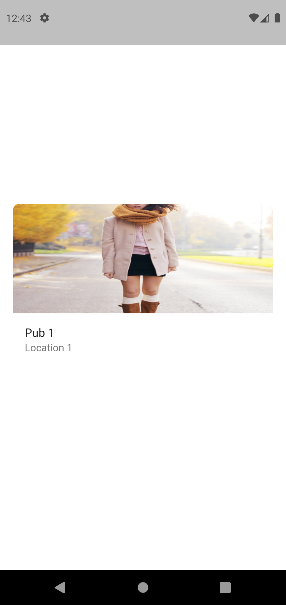

# My Documentation

My Private Documentation
 

## Widgets [Documentations](https://github.com/ccprogrammer/my-docs/tree/main/lib/docs) List:

Small Code Documentations

1. [ExpandingTextField](https://github.com/ccprogrammer/my-docs/tree/main/lib/docs) 
2. [IconButtonNoPadding](https://github.com/ccprogrammer/my-docs/tree/main/lib/docs) 
3. [MyBoxShadow](https://github.com/ccprogrammer/my-docs/tree/main/lib/docs) 
4. [MyRichText](https://github.com/ccprogrammer/my-docs/tree/main/lib/docs) 
5. [TextButtonNoPadding](https://github.com/ccprogrammer/my-docs/tree/main/lib/docs) 

## Screenshots:

<table align="center" style="margin: 0px auto;">
  <tr>
    <td>
        

            
            
<a href="lib/docs/app_bar/AppBarNormal.dart" target="_blank">AppBarNormal</a>

        

    </td>
    <td>
        

            
            
<a href="lib/docs/app_bar/AppBarSearch.dart" target="_blank">AppBarSearch</a>

        

    </td>
    <td>
        

            
            
<a href="lib/docs/app_bar/AppBarListTile.dart" target="_blank">AppBarListTile</a>

        

    </td>

   
  </tr>
  <tr>
        <td>
        

            
            
<a href="lib/docs/button/TextButtonCommon.dart" target="_blank">TextButtonCommon</a>

        

    </td>
  </tr>
    <tr>
        <td>
        

            
            
<a href="lib/docs/card/CardList.dart" target="_blank">CardList</a>

        

    </td>
       <td>
        

            
            
<a href="lib/docs/card/CardWithImage.dart" target="_blank">CardWithImage</a>

        

    </td>
       <td>
        

            
            
<a href="lib/docs/card/CardWithMap.dart" target="_blank">CardWithMap</a>

        

    </td>
         <td>
        

            
            
<a href="lib/docs/card/CardWithShadow.dart" target="_blank">CardWithShadow</a>

        

    </td>
         <td>
        

            
            
<a href="lib/docs/card/CardWithStretchHeaderImage.dart" target="_blank">CardWithStretchHeaderImage</a>

        

    </td>
  </tr>
  
</table>
